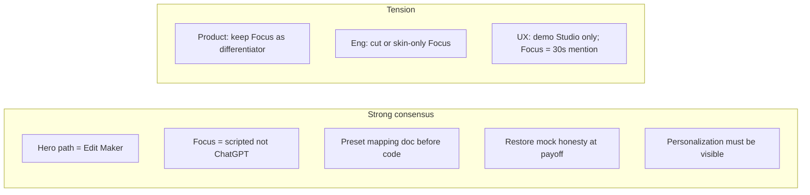

# Session Log - 2026-10-01

Session: `b03477f0` | Project: `8x_assignment` | Author: `ishanjain1502`

---

[LOG_ENTRY type=PROMPT num=1 session=b03477f0]
timestamp: 2026-10-01T19:39:00.000Z
model: composer-2.5

go through this updated doc, and tell me what changes or upgrades should we do
read through original hypothesis, and then read the refined discussion, and lets discuss how is it faring, use multiple agents to decide what each of them thinks of it, and lets discuss

do not make any changes on file yet

[LOG_ENTRY type=RESPONSE num=1 session=b03477f0]
timestamp: 2026-10-01T19:40:30.000Z
model: composer-2.5

Here’s a synthesis after reading the full doc and running three parallel reviews ([product](01285051-1baf-4a66-a33b-c30521f64f2a), [engineering](8acd7a7d-1169-4979-aa63-ebadaf07ac51), [UX/demo](b594c599-bbf3-427b-b4ba-85cf23b0bbc3)). No files were changed.

---

## How the refined plan fares vs the original hypothesis

### What the original got right (and is still the spine)

Your opening sketch is a **single funnel**: logged-out → auth → onboarding → **only the path they picked** → optional escape to “full” home with everything visible but **one real feature** (Edit Maker). The demo climax is explicit: mock flow → **popup that says it’s mock** → premade reel → **2:1 layout** (vertical video + what was “used”) → toggle **user input** (doesn’t change the video) → export / upload picker.

That’s optimized for **24 hours and a 5‑minute camera walkthrough**: one story, one payoff, evaluator-safe honesty at the end.

### What the refined discussion added (real upgrades)

The refined half turns a brainstorm into something you can **defend as product work**:

| Upgrade | Why it matters |
|--------|----------------|
| **Studio vs Focus** | Answers “why not clone Higgsfield?” — deliberate reduction of overwhelm, not a feature checklist. |
| **`ReelConfig` + same generation** | Keeps two UXes from becoming two products. |
| **“Coming soon” vs gray-disabled** | Better than a sea of half-dead tiles (though you still need one global pattern). |
| **Edit Recipe** | Stronger than “preset on the right” — narrates input → config → output. |
| **Sections 27–31** | In/out of scope, principles, phases, deploy checklist — submission-ready framing. |
| **Progressive disclosure in Focus** | Good product language (“Instagram” → 9:16) if implemented as **rules**, not an LLM. |

**Product fit for the assignment:** roughly **8/10** on judgment and narrative.  
**24h feasibility as written:** product ~8/10 story, engineering ~**5/10** on delivering everything in §27 “fully functional.”

### Where refinement drifted or regressed

1. **Mock transparency moved** — Original made honesty part of the **generation climax**; refined emphasizes polished lifecycle and “coming soon” elsewhere. Risk: evaluators think you built real ML, or you look evasive instead of “scoped smartly.”
2. **Platform creep** — Auth, DB, job API, upload pipeline, **two** primary modes, seven phases — reads like a creative OS; original was one reel flow + clever preview.
3. **Focus as co-equal to Studio** — Narrative says both are primary; build order puts Focus **after** full Edit Maker, so Focus is the first thing to ship half-baked.
4. **Small inconsistency** — Original: subtle disabled chrome on full home; refined: “Coming soon” tiles. Pick one system-wide.
5. **“Latest plays” fantasy** — Correctly cut in refined (curated assets); copy/assets need to sell “highlight reel” without implying live scraping.

---

## Three agents — where they agree and disagree



| Lens | Score / stance | Headline |
|------|----------------|----------|
| **Product** | 8/10 assignment story, 6/10 on 24h list | Merge: refined **narrative**, original **bet** — one hero path, hard preset rules, honesty on result. |
| **Engineering** | **5/10** as specified | ~2× UI surface vs original; critical path is `ReelConfig` → wizard → mock gen → result/export → deploy; **no DB** / guest auth unless OAuth works in hour one. |
| **UX / demo** | Refined intro, **original spine** for middle | Don’t 50/50 Studio/Focus on camera; golden path = onboarding → personalized home → Edit Maker → generate → toggle → export. |

**Unanimous recommendations (plan upgrades, not code yet):**

1. **Lock a golden walkthrough path** before build (e.g. Sports + Hype + Highlight → hero CTA → Messi flow).
2. **Preset resolver spec** — subject × style × music × effects → `demo-assets/*.mp4` + fallbacks so generation never feels random.
3. **Reinstate explicit mock disclosure** on or right after generate (merge with Edit Recipe; don’t rely only on polish).
4. **Tier Focus Mode** — “Demo Focus” = 4–5 chips / scripted prompts that fill `ReelConfig` and join the **same** generation UI; free-form chat = stretch.
5. **Auth fallback written in the plan** — guest / dev session / magic link if Google + deploy eats the window; personalization in `localStorage` if DB slips.
6. **Onboarding success test** — evaluator can name **one** UI change within ~10s on home (hero CTA, default subject, recommended style).
7. **Result screen non‑negotiables** — phone-frame 9:16 left; Edit Recipe | Your Input segmented control right; real export.
8. **Time-box Phase 1** — cap research; output one-page **must / nice / cut** screen list.
9. **Engineering appendix in the doc** (still discussion): routes, state ownership, asset manifest, generation API contract — refined doc is light here.
10. **Polish budget** — don’t leave result + generation to “Phase 6 only”; they’re the demo from the start of Edit Maker work.

**Build vs cut (engineering table, condensed):**

| Build | Cut or thin |
|-------|-------------|
| Studio Edit Maker wizard, mock progress, result + toggle, export | Real share integrations |
| Thin landing, shallow studio grid + modals | Full conversational Focus |
| Minimal onboarding → visible home delta | DB + real job queue (unless trivial) |
| Share **modal** only | Local upload **or** MVP thumbs-only until core path ships |

---

## Suggested doc upgrades (discussion only)

When you’re ready to edit `init.md`, these are the highest-value **additions/clarifications** (not rewrites of the whole doc):

1. **§ “Golden path & walkthrough script”** — Single scripted demo; Studio/Focus as optional appendix.
2. **§ “Mock transparency (acceptance)”** — Required banner/modal at generation complete (original popup intent).
3. **§ “Focus Mode tiers”** — Tier 1 = chip-guided `ReelConfig`; Tier 2 = full chat (stretch).
4. **§ “Preset mapping & fallbacks”** — Table or rules before Phase 2 ends.
5. **§ “Auth & persistence fallbacks”** — Explicit if-not-Google-then-what.
6. **§ “Engineering surface”** — Routes, `ReelConfig`, job contract, assets layout.
7. **Reconcile §8 vs original** — One sentence: global pattern is “Coming soon” modals, not disabled-gray home (or the reverse).
8. **Cap Studio breadth** — Max N capability cards; rest behind “Explore more (preview).”
9. **Local upload** — Mark as **v1.1** or “select + preview in list” unless on critical path for demo.

---

## How I’d frame “how it’s faring”

The refined doc is **the right submission story**: you understood Higgsfield, chose reduction, one vertical slice, honest scope. The original hypothesis is still **the right delivery contract** for 24h and the camera demo.

Right now the plan is **slightly over-promising** in §27 “fully functional” relative to principles §28 #4 (“one complete workflow beats many incomplete features”). The fix isn’t to throw away Studio/Focus — it’s to **tier them**: ship one unforgettable Edit Maker arc; Focus and upload are skins or phase‑2 unless time proves otherwise.

---

## Discussion prompts for you

1. **Focus in the walkthrough** — Must it be shown live, or is “same `ReelConfig`, here’s one scripted Focus handoff” enough?
2. **Honesty beat** — Popup at end (original) vs inline on result vs first “Generate” click — which matches your comfort on camera?
3. **Personalization** — What are your **2–3** concrete home differences (copy only vs default subject vs reordering)?
4. **Local upload** — Demo differentiator or first thing you’d cut?
5. **Auth** — Is Google already set up for deploy, or should the plan assume guest-first?

If you answer those, we can turn the list above into a tight “MVP lock” section for the doc in a follow-up — still without touching code until you say so.

[LOG_ENTRY type=PROMPT num=2 session=b03477f0]
timestamp: 2026-10-01T20:34:00.000Z
model: composer-2.5

golder walkthough path => Sports edit -> hero CTA -> messi selection -> messi highlights + bgm selection -> background selection out of multiple available presets like in higgsfield -> messi highlight final tiktok creation

Preset resolver spec - yes

Reinstate explicit mock disclosure -post generate

Tier Focus Mode - Demo Focus, gives few presets to user, and they can start from there, or define there focus, and intent and from where we can give them the list of options they might need, and then they can start further work, post that give coming soon, to show like ok this is how you can build it

Auth fallback -> magic link

6 didnt got what you meant, define question better

7. Yes

8. Yes

9. We need to go precise on them, ask out for any oddness, dont make any assumptions

10. ok

---
Suggested doc upgrades
Golden path & walkthrough script -> single scripted demo for studio mode
for focus mode, mockish behavior

Mock transparency (acceptance) -> Once generation is complete do the mock transparency acceptane

Focus Mode tiers -> Tier 2 -> give chat option, and some presets with highlight reel being one option always there

“Auth & persistence fallbacks” -> magic link, use next auth

Engineering surface -> yes

7. Global patter is "Coming Soon"

8. Yes

9. yes local upload only

---

lets discuss this setup again after these changes and suggestions

[LOG_ENTRY type=RESPONSE num=2 session=b03477f0]
timestamp: 2026-10-01T20:35:30.000Z
model: composer-2.5

## Locked setup (your decisions, restated)

### Studio golden path (walkthrough script)

```text
Onboarding (Sports / highlight intent)
    → Personalized home (hero CTA, sports-edit framing)
    → Edit Maker: Messi
    → Clip highlights + BGM
    → Background (multi-preset picker, Higgsfield-like)
    → Generate
    → Post-generate mock transparency
    → Result: 9:16 TikTok-style output + Edit Recipe | Your Input
    → Export (+ Share sheet as UI)
```

**Preset resolver** maps the full `ReelConfig` (including background) → one of your prepared `messi-*.mp4` (or fallback).

**Global pattern:** unavailable studio capabilities → **Coming Soon** (not gray-disabled).

**Studio breadth:** capped grid; overflow behind “Explore more (preview)”.

**Auth:** NextAuth with **magic link** as the realistic path (not Google-as-default unless you add it later).

**Polish:** generation + result treated as first-class from Edit Maker work, not only Phase 6.

---

## How this compares to the refined doc

| Your lock | Refined doc | Note |
|-----------|-------------|------|
| Background presets (Higgsfield-like) | Style + effects + transitions | You’re narrowing the **demo spine** to one visual axis named “background.” Resolver must treat **background** as a first-class key, not an afterthought on “Cinematic / Hype.” |
| Local upload in scope | §14 local upload | You want **only** local ingestion (no cloud). Still need to define **role in the golden path** vs optional branch. |
| Focus: presets + optional intent/chat → options list → then **Coming Soon** | Focus → same `ReelConfig` → full generation | Focus becomes a **product teaser + partial config**, not necessarily the same end-to-end generate as Studio unless you explicitly wire it. |
| Mock disclosure **after** generate completes | Was weakened in refined | Aligned with original; good for camera demo. |

Overall: **stronger demo spine** (Messi + background presets), **clearer honesty**, **smaller auth risk**. Main new risk is **Focus ending in Coming Soon** while Studio completes — evaluators need one sentence tying them together (“Focus collects intent; Studio ships the slice”).

---

## Item 6 — onboarding (clearer question)

Earlier I meant: *after onboarding, can someone point at the home screen and say “this changed because of my answers” in under 10 seconds?*

That’s an **acceptance test**, not a feature. Rephrased as decisions for you:

**A. What must change on home after Sports + highlight onboarding?** (pick any that are in scope for v1)

- Hero headline / subcopy (e.g. “Create a sports highlight”)
- Primary CTA label (e.g. “Sports edit” vs generic “Create Highlight”)
- Default or pre-highlighted subject (Messi suggested first)
- Recommended row order (Edit Maker / highlight first)
- Default background or BGM chip pre-selected when they enter Edit Maker
- Nothing visual except “Good evening, {name}” — personalization only inside Edit Maker

**B. Where is onboarding stored?**

- NextAuth user + DB field
- `localStorage` until account exists
- Both (magic link then merge)

**C. Can an evaluator skip onboarding** (deep link / “demo mode”) and still run the golden Studio script?

Without your picks on A–C, engineering will either over-build DB personalization or ship onboarding that feels like signup busywork.

---

## Local upload — precision only (no assumptions)

You said **local upload only** and to flag oddness. Here are the forks; your answers define scope.

**1. Golden path vs optional**

- Is the **5-minute demo** strictly preset Messi clips, with upload as “also supported”?
- Or must the walkthrough include **upload at least one clip**?

**2. What does upload affect?**

- **A)** UI only: thumbs in the clip list; **final video still preset mp4** from resolver (upload never changes output).
- **B)** Resolver input: e.g. “any custom clip selected” → specific preset or generic `custom-highlight.mp4`.
- **C)** User expects stitching: copy says “your clips” but output is preset — **needs mock disclosure** to mention uploads aren’t rendered in this build.

**3. Limits**

- Max clips / max file size / allowed MIME (mp4 only?) / what happens on unsupported codec?
- Order: drag reorder required or checkbox order enough?

**4. Persistence**

- Blob URLs die on refresh — is that OK for 24h?
- Should uploads survive magic-link session via IndexedDB?

**5. Oddness vs “background presets”**

- User uploads vertical phone footage but picks “Arena lights” background preset → result is still Messi TikTok preset. Is that **intentional** (background = look template, clips = narrative), or confusing?

**6. Focus Mode + upload**

- If Focus ends in Coming Soon before generate, does Focus even mention upload, or Studio-only?

**7. Deploy checklist**

- “Verify local upload works” on evaluator’s machine — any constraint (HTTPS required for file picker, mobile out of scope)?

Reply with short answers (e.g. `1: preset-only demo, 2: A, 3: …`). That becomes the upload spec in the doc.

---

## Background presets vs BGM vs resolver

Your path: **highlights + BGM + background (multi-preset)**.

Needs one explicit model:

```text
ReelConfig {
  subject, clips[], music, backgroundPresetId, ...optional effects
}
```

**Questions:**

1. Is **background** a visual template (frames, overlays, color grade) separate from **BGM**, both feeding the resolver?
2. How many background presets for v1 (e.g. 4–6)? Names aligned with Higgsfield or your own?
3. Does changing background **change the mp4** (different files per background) or only **Edit Recipe** text while video stays same until you have more assets?
4. Are “flames / styles” from the original hypothesis **inside** background preset, or a separate step you’re **dropping** from the golden path?

For preset resolver: a practical v1 is **coarse mapping** (e.g. `messi × hype-bgm × background-A → messi-hype-a.mp4`) with a **single fallback** (`messi-default.mp4`) so no combination 404s.

---

## Focus Mode (your Tier 2 shape)

You described:

1. **Demo Focus** — few presets; **Highlight reel** always one option.
2. User can pick preset **or** state focus/intent (chat).
3. System suggests **list of options** they might need (subject, vibe, music, background, …).
4. User continues → then **Coming Soon** (“this is how you’d build it”) rather than full generate.

**Implications:**

| If Focus stops at Coming Soon | Studio golden path |
|------------------------------|-------------------|
| Faster to ship; honest about depth | Carries the only **complete** vertical slice |
| Walkthrough: ~30–60s Focus “intent → options → preview of roadmap” | ~3–4 min on Studio Messi flow |
| Risk: feels like two products unless copy links them | Risk: Focus looks like the main idea in slides but isn’t in demo |

**Clarify:**

- After option list, does Focus show a **read-only summary** of `ReelConfig` + button **“Continue in Studio”** (deep link with query params), or **only** Coming Soon with no handoff?
- **Chat (Tier 2):** rule-based keyword matching only for 24h, or real LLM (probably out of scope)?
- Does Focus **ever** call generate, or mock transparency is **Studio-only**?

Suggested story line for camera: *“Focus is how we’d guide new users; for this build we fully implemented the Studio path you just saw.”*

---

## Mock transparency (post-generate)

**Acceptance:** when progress hits complete, **before or on** result screen:

- Short copy: demo uses prepared video; selections map to preset X; production would render from config.
- Then result with **Edit Recipe | Your Input** unchanged.

**One choice:** modal (original) vs dismissible banner on result. Modal is harder to miss on video; banner feels more product-like.

---

## Auth (NextAuth + magic link)

Fine for evaluators. Plan should still state:

- Email provider (Resend, etc.) and **env vars** for deploy.
- Logged-out landing → magic link → onboarding (first login only?).
- Whether **guest** exists for quick eval without email.

Persistence: onboarding prefs on **user record** vs local until linked — ties back to question 6B.

---

## Engineering surface (yes) — minimal checklist to add to doc

- **Routes:** `/`, `/login`, `/onboarding`, `/home`, `/studio`, `/focus`, `/create/edit-maker` (stepped or query `?step=`), `/result/[jobId]`
- **`ReelConfig` + `backgroundPresetId`**
- **Preset manifest** JSON: subjects, clips metadata, backgrounds, music, output mp4 keys, fallback rules
- **Generation:** `POST` create job → client poll or timed steps → resolve preset → post-generate disclosure flag
- **Focus:** state machine `preset | intent → options → coming_soon` (+ optional `handoff` to Studio)

---

## Feasibility after your locks

| Area | Outlook |
|------|---------|
| Studio golden path + background step + resolver | **Good** if asset count is small and mapping is documented early |
| Post-generate disclosure + result layout | **Good** — high demo value |
| Magic link + deploy | **Medium** — budget time for email + prod URL |
| Focus: presets + chat + options + Coming Soon | **Medium** — OK if **no** full generate and chat is scripted |
| Local upload | **Unknown** until you answer 1–7 above — highest oddness with preset output |
| Tier 2 “chat” | **Risky** if real LLM; **OK** as textarea + keyword chips |

---

## Suggested walkthrough split (for discussion)

| Segment | Time | Content |
|---------|------|---------|
| Intro | 30s | Not cloning Higgsfield; one workflow; mock where noted |
| Onboarding + home | 45s | Sports; point at **one** visible delta (once you answer 6A) |
| Studio | 2.5–3m | Messi → clips → BGM → **background presets** → generate → disclosure → result toggle → export |
| Focus | 45–60s | Preset or intent → suggested options → Coming Soon (+ handoff if you want) |
| Studio shell | 20s | One Coming Soon tile — intentional breadth |
| Close | 20s | What production would add |

---

## What I need from you to close the loop

1. **Onboarding 6:** answers to **A, B, C** above.  
2. **Local upload:** answers to **1–7** in that section.  
3. **Background:** separate from BGM in resolver? How many presets? Different mp4 per background or recipe-only?  
4. **Focus handoff:** Coming Soon only vs **Continue in Studio** with prefilled config.  
5. **Mock UI:** modal vs banner after generate.

Once those are set, the plan is coherent enough to update `init.md` (when you ask) without fighting itself: **Studio = ship**, **Focus = guided intent + roadmap**, **upload = exactly what you specify**, **honesty at generate complete**.

[LOG_ENTRY type=PROMPT num=3 session=b03477f0]
timestamp: 2026-10-01T21:13:00.000Z
model: composer-2.5

onboarding
no, no one will know that change, but we can highlight it, with a small modal there, that these options came from your onboarding choices

A. inside the focus mode, sports highlihgt should come top, this selection will affect focus mode only

B. DB field

C. no specific things for evaluators
---
Local upload — precision only

5-minute demo strictly preset Messi clips, allows you to upload more file, but doesnt change anything on final product, shows your uploaded video on UI, uploaded video needs to be smaller then 20MB

initial flow of this process is
you come on highlight reel page
you select real celebrity
enter the name (after entering it gets changed to Lionel Messi , with a warning that it is a preset for it)
select a song (give the YT link for the song) after giving it, it will get autoselected again the same as celebrity name as "Remember the name"

2. A

3. size 20MB, on unsupported codec, throw error, unsupported types and type codec supported

4. no need for uploads to survive, all uploads is happening on local

5. its intentional

6. Focus should mention upload, and should use the same utility, we want to show how focus mode will look, although nothing will work over it

7. no

--
Background presets vs BGM vs resolver
1. yes, bgm stands for background music only
2. 4 - aligned with higgsfield
3. video stays same, we have only one video, all this selection is mock
4. not original hyporthesis but an option on it, not yet decided on what preset we will have for the default answer, we will decide and change it later

Focus Mode (your Tier 2 shape)
1. Yes
2. yes
3. yes
4. Coming soon, try highlight reel in studio mode instead

real LLM out of scope
moclk transparency in focus mode

Mock transparency (post-generate)
Short copy method

Auth (NextAuth + magic link)

As for UI components go for the ones used at https://higgsfield.ai/ and if any confusion, ask explicitly

lets go through this, and confirm

[LOG_ENTRY type=RESPONSE num=3 session=b03477f0]
timestamp: 2026-10-01T21:14:30.000Z
model: composer-2.5

## Confirmed product contract (v1)

This is the locked interpretation from your answers. Treat anything marked **open** as still to decide before implementation.

---

### 1. Modes and roles

| Mode | Role in build | Walkthrough |
|------|----------------|-------------|
| **Studio** | Only **complete** path: highlight reel → generate → short mock disclosure → result → export | **Main** demo (~3 min) |
| **Focus** | Guided intent, sports highlight **first** (from onboarding), presets + optional intent/chat (**no real LLM**), option list, upload UI (**same utility**, no output effect), summary → **Coming Soon** → “Try Highlight Reel in Studio” | **Secondary** (~1 min) |
| **Studio grid** | Higgsfield breadth, capped; rest **Coming Soon** | Quick beat |

**Principle:** One vertical slice in Studio; Focus is a **credible preview** of guided creation, not a second generator.

---

### 2. Onboarding

| Decision | Locked |
|----------|--------|
| Visible product change without explanation | **No** — home does not obviously scream “Sports” |
| Highlight onboarding | **Small modal** on relevant entry (home and/or entering Focus): options reflect onboarding choices |
| Personalization scope | **Focus Mode only** — e.g. **Sports highlight** at top of Focus options |
| Persistence | **DB field** on user (NextAuth identity) |
| Evaluator shortcuts | **None** — no demo mode / skip links |

**Confirm:** Modal triggers **once** after onboarding, **every** Focus visit, or only first home visit?

---

### 3. Studio golden path (scripted)

```text
Highlight reel (Edit Maker entry)
  → Pick celebrity flow: user types name → resolves to Lionel Messi + warning (preset demo)
  → Preset Messi clips (checkbox/select)
  → Optional local uploads (see §4) — shown in UI, not in final file
  → Song: user pastes YouTube URL → auto-selects track "Remember the Name" (+ same “preset” pattern as celebrity?)
  → Background music choice (from catalog; YT path is the scripted beat for one track)
  → Background visual presets (4, Higgsfield-aligned names/feel) — affects recipe only
  → Generate (mock progress)
  → Post-generate: short copy mock transparency
  → Result: single prepared TikTok-style video (same file for all selections) + Edit Recipe | Your Input
  → Export (+ Share UI)
```

**Resolver (simplified per your lock):**

- **One output video** for the assignment build; selections drive **UI + Edit Recipe / Your Input**, not different mp4s.
- Still worth a **manifest** (celebrity, clips, BGM, background id, upload metadata) for disclosure copy and future mapping.
- **Default background preset** for golden path: **TBD** (you’ll pick later).

**BGM:** “Background music” only — separate from **background visual presets** (4).

**Effects / flames:** Optional later; **not** in the golden path until you choose a default preset set.

---

### 4. Local upload

| Rule | Locked |
|------|--------|
| Demo | **Preset Messi clips**; upload is **optional extra** in the list |
| Output | **2A** — uploads **never** change final mp4 |
| UI | Thumbnails / preview of uploaded files in clip step |
| Size | **≤ 20 MB** per file |
| Codec/types | Reject with clear error + list of **supported** types/codecs |
| Persistence | **None** — local only, refresh clears |
| vs background preset | **Intentional** — user may upload phone footage while “background” is a look template; final video stays the one preset |
| Focus | **Same upload component/utility**; same no-op on output |
| Deploy | No special HTTPS/mobile requirements beyond normal browser file API |

---

### 5. Focus Mode (Tier 2, no LLM)

```text
Entry (sports highlight prioritized from DB onboarding)
  → Presets and/or free-text intent (rule-based / chips, not LLM)
  → Suggested options (subject, clips, music, background, upload, …)
  → Read-only ReelConfig-style summary
  → Coming Soon + CTA: Try Highlight Reel in Studio
  → Short copy mock transparency (same honesty pattern as Studio, at appropriate step — e.g. when they’d “generate” or at Coming Soon)
```

| Locked | |
|--------|--|
| Handoff | **Yes** — summary then Studio CTA (prefill where cheap: e.g. sports/highlight intent) |
| Generate in Focus | **No** — stop at Coming Soon |
| LLM | **Out of scope** |
| Mock transparency | **Yes** in Focus (short copy, not modal) |

**Open:** Does Focus mock transparency appear **on Coming Soon screen** only, or also if user hits a disabled “Generate”?

---

### 6. Mock transparency

| | Locked |
|--|--------|
| When | After Studio generate **completes**; Focus uses **short copy** at the equivalent honesty moment |
| Format | **Short copy** (inline/banner), **not** a blocking modal |
| Message intent | Prepared demo video; choices are reflected in recipe/input, not rendered in this build |

---

### 7. Auth

- **NextAuth** + **magic link**
- Onboarding prefs → **user DB field**
- No guest/evaluator bypass unless you add it later

**Open:** Magic link email provider (Resend, etc.) and whether first login **always** forces onboarding.

---

### 8. UI direction ([Higgsfield](https://higgsfield.ai/))

Target: **feel** like Higgsfield (dark creative suite, strong video cards, preset grids like Visual Effects / Genjutsu, clear CTAs), implemented in your stack — not a pixel clone.

**Please confirm explicitly** (pick or adjust):

1. **Chrome:** Top nav with Explore / Video / Image-style buckets vs **minimal shell** (logo + Studio / Focus + account)?
2. **Theme:** Dark-first, high contrast, video-forward cards — **yes/no**?
3. **Preset picker (backgrounds):** Grid of **video loop thumbnails** + “Recreate”-style labels (per their VFX section) vs static images?
4. **Typography:** Match their **bold marketing headings + compact UI** loosely, or any font license you already have in mind?
5. **Components:** Pure **Tailwind + custom** vs **shadcn/Radix** styled to match Higgsfield?
6. **Celebrity / song theater:** Warning banner style — **yellow inline alert** vs Higgsfield-style **toast**?

If you don’t care on 3–6, we default: dark shell, shadcn primitives, video-card preset grid, inline alert for preset substitution.

---

### 9. Doc / engineering checklist (when you edit `init.md`)

- Golden path script (Studio only, Messi + YT → Remember the Name)
- Focus mock path + Studio handoff
- `ReelConfig` + manifest (even with single mp4)
- Upload validation spec (20MB, MIME/codecs)
- Focus-only onboarding ordering (sports highlight first)
- Home modal copy for onboarding provenance
- Coming Soon pattern globally
- NextAuth magic link + DB onboarding field
- Single output asset + “recipe-only” selections

---

### 10. Tensions to accept (not bugs)

1. **Upload + one video** — OK if disclosure + Edit Recipe mention “demo render”; optional upload listed under Your Input.
2. **YT link → fixed track** — Great demo; label it preset substitution like Messi name.
3. **Onboarding invisible on home except modal** — Evaluator needs the modal in the script: *“We stored prefs; Focus is where it surfaces.”*
4. **4 Higgsfield-aligned backgrounds, one mp4** — Recipe must show background id; changing it must not imply a new render in copy.

---

## Sign-off

If this matches your intent, reply with:

1. Modal trigger (once / first home / each Focus).
2. Focus transparency placement (Coming Soon only vs also fake Generate).
3. Answers to UI questions **1–2** minimum (nav + dark theme); 3–6 optional or “defaults OK”.
4. **Yes — lock v1** or corrections in one message.

After that, updating `init.md` is straightforward; still no file edits until you say to write the doc.

[LOG_ENTRY type=PROMPT num=4 session=b03477f0]
timestamp: 2026-10-01T21:16:00.000Z
model: composer-2.5

lock v1, and update @.docs/init.md

[LOG_ENTRY type=PROMPT num=5 session=b03477f0]
timestamp: 2026-10-01T21:17:00.000Z
model: composer-2.5

lock v1, and update init.md , by adding new section under the name of tightening boundaries discussion

[LOG_ENTRY type=RESPONSE num=5 session=b03477f0]
timestamp: 2026-10-01T21:18:30.000Z
model: composer-2.5

**v1 is locked** and appended to [`.docs/init.md`](E:\Projects\8x_assignment\.docs\init.md) as **Tightening Boundaries Discussion** (after §31).

### What the new section contains
- **Modes:** Studio = full slice; Focus = guided UI → Coming Soon → Studio CTA; no LLM
- **Onboarding:** DB field; **one-time home modal**; **Focus-only** ordering (sports highlight first)
- **Auth:** NextAuth magic link
- **Studio golden path:** Messi name preset, YT → “Remember the Name”, BGM vs 4 visual backgrounds, single output mp4
- **`ReelConfig` + manifest** (recipe-only selections in v1)
- **Local upload:** 20MB, validation errors, UI-only, shared in Focus
- **Mock transparency:** short copy post-generate (Studio) and on Focus Coming Soon
- **Result screen** requirements, **Coming Soon** globally, UI defaults toward [Higgsfield](https://higgsfield.ai/)
- **Routes / build order / walkthrough timing**
- **Explicitly not in v1**

### Defaults documented (you said lock without answering every open item)
- Onboarding modal: **once per user** after first home visit post-onboarding  
- UI: minimal shell, dark theme, shadcn + inline alerts for preset substitution  
- Default background on golden path: **TBD** in manifest  

If you want the modal on **every Focus entry** or OAuth added later, say so and we can tweak only that subsection. Ready to move to Phase 2 (routes + manifest) in code when you are.

[LOG_ENTRY type=PROMPT num=6 session=b03477f0]
timestamp: 2026-10-01T21:24:00.000Z
model: composer-2.5

/using-superpowers for frontend use nextJS
and create specs for the project, take information from @.docs/init.md to understand what we need to build
do not make any assumptions

[LOG_ENTRY type=RESPONSE num=6 session=b03477f0]
timestamp: 2026-10-01T21:25:30.000Z
model: composer-2.5

Using the **writing-plans** skill mindset: this pass is a **requirements spec** sourced only from `init.md` (not a step-by-step implementation plan—that waits on §12 open decisions).

Created **[`.docs/project-spec-v1.md`](E:\Projects\8x_assignment\.docs\project-spec-v1.md)**.

### What it contains
- **Precedence:** Tightening Boundaries → Refined §1–31 → Original hypothesis  
- **Next.js** structure: routes, modes, journeys, golden Studio steps, Focus flow, result/export/share  
- **`ReelConfig`**, single demo mp4, manifest, mock generation, mock transparency rules  
- **Local upload** rules from Tightening (20MB; supported types/codecs **not** in init.md)  
- **UI defaults** (Tailwind, shadcn/Radix, dark, Higgsfield-inspired)  
- **Submission checklist** from §30 Phase 7 + `.agent-logs/`  
- **Conflict register** where refined doc disagrees with v1 lock (auth, Focus generate, style/customization steps, etc.)

### No assumptions — §12 Open decisions (16 items)
Examples you must decide (or amend `init.md`) before implementation:
- DB/ORM, onboarding schema, modal-seen flag  
- Magic link email provider  
- Upload MIME/codecs (required for error copy)  
- Studio grid cap number  
- Four background preset names/assets  
- Whether §15–17 style/customization ships beyond golden path  
- API vs client-only generation jobs  
- Focus handoff prefill fields  

### Intentional tension documented
§27 / Phase 4 list **style + customization** as fully functional; **Tightening golden path does not include those steps**. The spec does **not** pick a winner—it flags **O10** for you to lock.

---

**Next step options:**
1. **Resolve §12** in chat or a short addendum to `init.md`, then I can write `docs/superpowers/plans/2026-10-02-higgsfield-v1.md` with bite-sized Next.js tasks.  
2. **Start implementation** with only locked items; leave open fields as explicit stubs.

Which open items do you want to answer first (O5 codecs, O1 DB, O10 extra wizard steps are the usual blockers)?

[LOG_ENTRY type=PROMPT num=7 session=b03477f0]
timestamp: 2026-10-01T21:30:00.000Z
model: composer-2.5

please use /using-superpowers for this

[LOG_ENTRY type=RESPONSE num=7 session=b03477f0]
timestamp: 2026-10-01T21:31:30.000Z
model: composer-2.5

Using **using-superpowers** with **brainstorming** (design artifact) and **writing-plans** (implementation plan). The repo had a spec but no decision gate or executable plan; that’s what was added.

### What was added

| Artifact | Purpose |
|----------|---------|
| [`docs/superpowers/specs/2026-10-02-higgsfield-v1-design.md`](E:\Projects\8x_assignment\docs\superpowers\specs\2026-10-02-higgsfield-v1-design.md) | Design summary + link to spec; **review before Task 1** |
| [`.docs/decisions-v1.template.md`](E:\Projects\8x_assignment\.docs\decisions-v1.template.md) | Fills **project-spec §12** (O1–O20); copy → `decisions-v1.md` |
| [`docs/superpowers/plans/2026-10-02-higgsfield-v1.md`](E:\Projects\8x_assignment\docs\superpowers\plans\2026-10-02-higgsfield-v1.md) | Next.js tasks 0–10 (Vitest, wizard, auth, Focus, deploy checklist) |
| [`project-spec-v1.md` §23](E:\Projects\8x_assignment\.docs\project-spec-v1.md) | Points at these artifacts (spec v1.1) |

### Hard gate (no assumptions)

**Task 0** must finish before code: copy the template to `.docs/decisions-v1.md` and replace every `REQUIRED` (DB, email provider, upload MIME/codecs, 4 backgrounds, Messi clips, BGM list, copy strings, etc.).

The plan does **not** invent those values—that matches your “no assumptions” rule.

### Suggested defaults when you fill the template (optional, your call)

- **O10** `includeStyleCustomizationSteps`: **`no`** (Tightening golden path only)  
- **O12** `strategy`: **`client-only`** mock generation  
- **O11** `allowOtherSubjects`: **`no`** unless you want extra UI  

### Next step (pick one)

1. **You** fill `.docs/decisions-v1.md` from the template, then say **Subagent-Driven** or **Inline Execution** for the plan.  
2. **We** go through the template **one question at a time** (brainstorming style)—start with **O1: SQLite + Prisma for 24h deploy** vs Postgres.

Which execution mode do you want after Task 0, and do you want to answer O1 here first?

[LOG_ENTRY type=PROMPT num=8 session=b03477f0]
timestamp: 2026-10-01T21:36:00.000Z
model: composer-2.5

dont use sqlite, we are going to use supabase with nextjs here

[LOG_ENTRY type=RESPONSE num=8 session=b03477f0]
timestamp: 2026-10-01T21:37:30.000Z
model: composer-2.5

Updated docs to **lock O1 to Supabase (PostgreSQL) + Next.js** — **no SQLite**.

### What changed

| File | Update |
|------|--------|
| [`.docs/decisions-v1.template.md`](E:\Projects\8x_assignment\.docs\decisions-v1.template.md) | O1: Supabase, `DATABASE_URL` + `DIRECT_URL`, Prisma + `@auth/prisma-adapter`, Supabase public env vars |
| [`docs/superpowers/plans/2026-10-02-higgsfield-v1.md`](E:\Projects\8x_assignment\docs\superpowers\plans\2026-10-02-higgsfield-v1.md) | Task 7: Supabase project, Prisma migrate, NextAuth + PrismaAdapter |
| [`docs/superpowers/specs/...-design.md`](E:\Projects\8x_assignment\docs\superpowers\specs\2026-10-02-higgsfield-v1-design.md) | Architecture notes |
| [`.docs/project-spec-v1.md`](E:\Projects\8x_assignment\.docs\project-spec-v1.md) | §12 O1 marked locked |

### Stack interpretation (confirm this is what you want)

- **Database:** Supabase Postgres  
- **App data + NextAuth tables:** **Prisma** on Supabase URLs (pooler for runtime, direct for migrations)  
- **Auth UX:** still **NextAuth magic link** (v1 lock in `init.md`) — not Supabase Auth, unless you want to switch  

Supabase JS (`@supabase/ssr`) is optional in the template for anything you don’t route through Prisma.

### Still open in Task 0

O4 (magic link **email** provider — Resend vs SMTP, etc.), O5–O20, and O1’s `SUPABASE_SERVICE_ROLE_KEY` → `use` | `skip`.

Do you want to keep **NextAuth + Prisma on Supabase**, or move magic link to **Supabase Auth** instead?

[LOG_ENTRY type=PROMPT num=9 session=b03477f0]
timestamp: 2026-10-01T21:37:00.000Z
model: composer-2.5

Lets first focus on google login, and leave magic link for now

[LOG_ENTRY type=RESPONSE num=9 session=b03477f0]
timestamp: 2026-10-01T21:38:30.000Z
model: composer-2.5

Auth is updated across the docs: **Google first**, **magic link deferred**.

### Locked for v1
- **NextAuth** + **GoogleProvider** — login CTA: **Continue with Google** (init.md §5)
- **Prisma** on **Supabase Postgres** for users/sessions + onboarding fields
- **No** Email / magic link provider or UI in v1

### Files touched
- `init.md` (Tightening — Authentication, routes, build priority, “not in v1”)
- `.docs/decisions-v1.template.md` (O4)
- `.docs/project-spec-v1.md`
- `docs/superpowers/specs/2026-10-02-higgsfield-v1-design.md`
- `docs/superpowers/plans/2026-10-02-higgsfield-v1.md` (Task 7 + constraints; plan header also aligned with Supabase)

### Env you’ll need for Task 7
- `AUTH_SECRET`, `AUTH_URL` (production site URL)
- `GOOGLE_CLIENT_ID`, `GOOGLE_CLIENT_SECRET`
- Redirect URI: `{AUTH_URL}/api/auth/callback/google`

### When you add magic link later
Keep O4 structure: add Email provider + email env vars; optional “Sign in with email” on `/login` without removing Google.

Copy `.docs/decisions-v1.template.md` → `.docs/decisions-v1.md` when you’re ready for Task 0 (O4 is mostly filled; O5+ still need your choices). Want to start **Task 1** (Next.js scaffold) or finish the rest of Task 0 first?

[LOG_ENTRY type=PROMPT num=10 session=b03477f0]
timestamp: 2026-10-01T21:40:00.000Z
model: composer-2.5

Start with task 1

[LOG_ENTRY type=RESPONSE num=10 session=b03477f0]
timestamp: 2026-10-01T21:41:30.000Z
model: composer-2.5

**Task 1 complete.** Next.js is at the repo root (scaffold was created in `next-scaffold/` and moved up because `create-next-app` refuses a non-empty root).

### Done
- **Next.js 16** (App Router, TypeScript, Tailwind v4, ESLint)
- **shadcn/ui:** `button`, `input`, `dialog`, `alert`, `tabs`, `card`, `progress`
- **Dark theme:** `className="dark"` on `<html>` + shadcn tokens in `app/globals.css`
- **`components/shell/app-header.tsx`:** Studio / Focus links + disabled Account
- **Landing** (`/`): Start Creating → `/login`, Explore → `/studio` (init.md CTAs)
- **Stubs:** `/studio`, `/focus`, `/login`
- **`npm run build`** passes

### Run locally
```bash
cd E:/Projects/8x_assignment && npm run dev
```
Open http://localhost:3000

### Note
shadcn v4 `Button` has no `asChild`; nav uses `Link` + `buttonVariants()`.

### Not done (per your rules)
- **Task 0** — `.docs/decisions-v1.md` still optional before Task 2+
- **Git commit** — say if you want Task 1 committed

Next up: **Task 2** (`ReelConfig`, manifest, resolver + Vitest). Continue?

