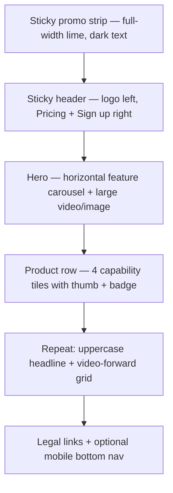

# Session Log - 2026-10-02

Session: `3610652d` | Project: `8x_assignment` | Author: `ishanjain1502`

---

[LOG_ENTRY type=PROMPT num=1 session=3610652d]
timestamp: 2026-10-02T05:57:00.000Z
model: composer-2.5

can you open https://higgsfield.ai/ in your browser?
give it a try

[LOG_ENTRY type=RESPONSE num=1 session=3610652d]
timestamp: 2026-10-02T05:58:30.000Z
model: composer-2.5

Yes — it loaded in the Cursor browser.

**URL:** [https://higgsfield.ai/](https://higgsfield.ai/)  
**Title:** Higgsfield AI — AI-native creative suite

The homepage shows the usual marketing layout: top promo bar, hero carousel (Genjutsu Restyle, ChatGPT extension, Production Skills Bundle, etc.), product tiles (Seedance 2.5, Nano Banana Pro, Genjutsu, Supercomputer), Global Film Festival submissions, Visual Effects presets, and community projects. A **Cookie Notice** modal is on top with Accept / Reject / Cookie Preferences.

If you want next steps, I can dismiss the cookie banner, open a section (e.g. MCP, Explore, Pricing), or compare this to your assignment spec.

[LOG_ENTRY type=PROMPT num=2 session=3610652d]
timestamp: 2026-10-02T05:58:00.000Z
model: composer-2.5

go through the UI style and layout, so that we can copy it for our frontend as well

feel free to ask any doubts

[LOG_ENTRY type=RESPONSE num=2 session=3610652d]
timestamp: 2026-10-02T05:59:30.000Z
model: composer-2.5

I walked through [higgsfield.ai](https://higgsfield.ai/) in the browser (homepage, login route, scrolled through product tiles, festival grid, VFX presets) and compared it to your spec and current `globals.css` / landing / studio grid. Below is a practical style guide you can copy **in spirit** for v1—not a full marketing clone.

---

## 1. Design tokens (what to steal)

| Token | Higgsfield (measured) | Your app today |
|--------|------------------------|----------------|
| **Canvas** | `rgb(19, 21, 23)` (~`#131517`) near-black | Dark shadcn default `oklch(0.145…)` — close |
| **Primary text** | `rgb(247, 247, 248)` | `foreground` — close |
| **Brand accent** | **Neon lime** `rgb(209, 254, 23)` (`#D1FE17`) | Purple radial gradients on `/` — **different brand feel** |
| **Accent on dark** | Lime at ~8–20% opacity for ghost buttons / cards | Muted grays — add lime-tinted surfaces |
| **Muted copy** | ~`rgb(168, 168, 168)` | `muted-foreground` — fine |
| **“Top” badge** | Hot pink `rgb(255, 0, 91)`, uppercase | Not used yet |
| **“New” badge** | Lime 20% bg + lime text, 10px, 6px radius | Could mirror for “Available” vs “Coming soon” |
| **Font** | **Inter**, 16px body | **Geist** — acceptable if you keep weight/spacing similar |
| **Radius** | **10px** pills/buttons, **16px** media cards, **12px** small tiles | `0.625rem` (~10px) + `rounded-xl`/`2xl` — aligned |

**Primary CTA pattern:** filled lime button, **black/dark text** (`~#1A1A1A`), `font-weight: 500`, `14px`, `border-radius: 10px`, horizontal padding ~12px.

**Secondary CTA:** dark surface + subtle border, or lime ghost (`rgba(209,254,23,0.08)` bg + lime label) — e.g. “Login” vs “Sign up”.

---

## 2. Global layout anatomy (marketing home)

Higgsfield stacks these layers top to bottom:



**Promo strip:** full-width **lime bar**, centered offer copy, black text — very loud; optional for your assignment.

**Header:** ~45px tall, sticky; logo wordmark; right cluster (social, pricing pill, **Sign up**). No huge link farm on the bar itself (deep nav lives elsewhere / drawer).

**Mobile (viewport ~708px in our browser):** **fixed bottom nav** — Home, Community, **center lime “create” square**, Library, Profile. Your spec explicitly wants a **minimal shell** (logo, Studio / Focus, account), so you probably **skip** this bottom bar on authenticated app routes and maybe only echo it on landing if you want extra fidelity.

---

## 3. Typography & voice

Higgsfield is **loud and editorial**:

- **Display / section titles:** uppercase, **bold (700)**, tight negative tracking (e.g. `56px / -2.24px` for big promos; `32–36px` for sections).
- **Card titles:** often **uppercase** (hero carousel uses `H3` at 16px, weight 700, uppercase).
- **Preset names** (“Floating fall”, “High flip”): **36px uppercase** over imagery.
- **Body / subtitles:** normal case, gray, smaller under titles.

Your landing today is **softer** (sentence-case hero, gradient text, “Creative AI studio” pill). To feel more Higgsfield: push **uppercase labels**, **heavier weights**, and **lime** instead of purple glow — while keeping copy shorter per project-spec (“simplified landing”).

---

## 4. Card & grid patterns (most relevant to your v1)

### A. Capability / product tiles (Studio explore, landing)

- **Media-first:** thumbnail or loop fills the card; `border-radius: 16px`; `overflow: hidden`.
- **Bottom gradient scrim** + title + one-line subtitle (you already do this in `capability-grid.tsx` and landing `ShowcaseCard`).
- **Badges:** “Top” (pink), “New” (lime tint), category chips (“Image”) in gray — top-left or on metadata row.
- **Aspect ratios:** mixed on marketing site (wide hero ~2.5:1, phone previews 9:16, studio grid you use **4:5** — reasonable Higgsfield cousin).

### B. Visual Effects / preset row (Highlight Reel background picker)

- Horizontal **scroll strip** of tall preset cards.
- **Title on image** (uppercase).
- **“Recreate”** action: lime-tint surface `rgba(209,254,23,0.1)`, lime text, 10px radius, 14px — good reference for secondary actions on preset cards.

### C. Community / “explore projects”

- **Bento / masonry:** mixed tile sizes (large vertical + smaller horizontals), 12px radius, no heavy borders — separation by gap on black.
- Optional for landing; your **capped Studio grid** can stay uniform 4:5 for clarity.

### D. Video-forward hero

- Autoplaying muted video or cinematic still, dark overlay, **uppercase product name** + one line value prop.
- Your landing’s center **9:16 phone frame** with play affordance is already on-brand; swap purple shadow for **lime rim glow** if you want closer match.

---

## 5. Auth & modals

- Login route uses the **same dark header**; content is sparse in our session (likely OAuth/email widgets load progressively).
- **Cookie modal:** dark panel, stacked full-width buttons — **Accept** = lime fill; reject/preferences = dark gray. Your Coming Soon dialog can mirror: dark `popover`, primary = lime, back = ghost.

---

## 6. What your spec says to **not** copy

From `project-spec-v1.md` / `init.md` UI direction:

- **Not** full Higgsfield nav (Explore, Image, Video, MCP, …).
- **Minimal chrome:** logo, **Studio / Focus**, account — keep `app-header.tsx` shape, restyle it.
- **Simplified landing** — don’t ship every section (festival, Supercomputer, full VFX catalog).
- **Coming Soon** dialogs, not gray-disabled broken tiles.

So: **tokens + cards + typography + video emphasis** yes; **promo strip + mega-menu + bottom tab bar** only if you choose extra polish on `/` alone.

---

## 7. Concrete Tailwind direction (when you implement)

Suggested CSS variables (map to shadcn `--primary`):

```css
/* Higgsfield-inspired — illustrative */
--hf-bg: #131517;
--hf-fg: #f7f7f8;
--hf-muted: #a8a8a8;
--hf-accent: #d1fe17;
--hf-accent-fg: #1a1a1a;
--hf-accent-muted: rgb(209 254 23 / 0.1);
--hf-badge-hot: #ff005b;
```

- Set `--primary` to lime + `--primary-foreground` to dark.
- Replace landing purple radials with **subtle** lime/black gradients or none.
- Buttons: `rounded-[10px]` for HF fidelity; keep shadcn `Button` variants.
- Labels: `text-[10px] uppercase tracking-wider` (you already use this on studio cards).
- Section titles: `text-3xl font-bold uppercase tracking-tight`.

---

## 8. Gap vs your current UI

| Area | Higgsfield | Your repo |
|------|------------|-----------|
| Accent | Lime | Purple gradients |
| Type | Inter, aggressive uppercase | Geist, marketing-soft |
| Header | Logo + Pricing + Sign up | “Studio” text + Studio/Focus ghosts |
| Landing density | Carousel + many sections | Focused hero + 9:16 + 4 cards — **good for v1** |
| Studio grid | Badges + mixed layouts | Gradient scrim cards — **structure matches** |

---

## Questions for you (so we don’t guess wrong)

1. **Accent:** Commit to **lime** as `--primary` everywhere, or lime only on marketing and neutral primary in the app shell?
2. **Typography:** Switch landing/section titles to **uppercase display**, or keep sentence-case for readability in the walkthrough?
3. **Font:** Stay on **Geist** or add **Inter** for closer match?
4. **Landing only:** Include **lime promo strip** and/or **mobile bottom nav** on `/`, or stay desktop-first minimal?
5. **Studio grid:** Keep uniform **4:5** cards, or add a **horizontal scroll** row for background presets (more VFX-like)?
6. **Logo:** Text “Higgsfield”-style wordmark + icon, or your own assignment brand name with the same chrome layout?

Once you answer these, we can turn this into a short `decisions-v1` UI section or a direct pass on `globals.css`, `button.tsx`, `app-header.tsx`, and `/` without drifting from the tight v1 scope.

[LOG_ENTRY type=PROMPT num=3 session=3610652d]
timestamp: 2026-10-02T06:07:00.000Z
model: composer-2.5

copy the full higgsfield nav and design philosophy
give an extra option for studio mode and focus mode, just after top navigation
[studio][focus]
these two are like large buttons, which cover the entire width, with some padding on the sides, and text at center, default selection is studio, once you click on focus, you move to focus mode, which we have alredy discussed

also add evaluator role where you dont need login (suggest good methods for it)

[LOG_ENTRY type=RESPONSE num=3 session=3610652d]
timestamp: 2026-10-02T06:08:30.000Z
model: composer-2.5

Implemented Higgsfield-style chrome, the Studio/Focus mode bar, and evaluator access. Summary:

## Higgsfield shell & theme

- **Lime-on-charcoal tokens** in `globals.css` (`--hf-accent`, `#131517` background, Inter-first typography).
- **Promo strip** (dismissible, like Higgsfield).
- **Top bar**: logo, Instagram, Pricing, Login / Sign up (lime CTA) or **Evaluator** / account when signed in.
- **Product nav** (Explore, Image, Video, MCP, API, …) — most open **Coming Soon**; **Explore** → `/studio`.
- Replaces the old minimal `app-header`.

## Studio / Focus mode bar

- Full-width **two large tabs** under the product nav on `/home`, `/studio`, `/focus`, `/create/*`.
- **Studio** default (active on `/studio`, `/home`, `/create/*`).
- **Focus** active on `/focus`; click navigates to `/focus`.
- Implemented in `components/shell/mode-switcher.tsx` + `lib/app-routes.ts`.

## Evaluator access (no Google login)

**Recommended approach (what we shipped):** env-gated **NextAuth Credentials** provider — no DB user, JWT session with walkthrough onboarding defaults (sports + highlight reels + hype).

1. In `.env`:
   ```env
   EVALUATOR_ACCESS_ENABLED="true"
   EVALUATOR_ACCESS_TOKEN="your-long-secret"
   AUTH_SECRET="..."  # required
   ```
2. **Login page** → “Continue as evaluator” + token field.
3. **One-click link for reviewers:**  
   `{AUTH_URL}/evaluator?token={EVALUATOR_ACCESS_TOKEN}` → auto sign-in → `/studio`.

**Why this method:** shared secret is easy for deploy review; session is a normal NextAuth JWT (works with existing middleware); no public “skip onboarding” URLs without the token; token stays server-side in env (not in the repo).

**Alternatives** (not implemented): IP allowlist in middleware, short-lived signed magic links, or a separate `DEMO_PASSWORD` — all trade convenience vs. exposure.

**Note:** Older `init.md` text said “no evaluator bypass”; you asked for this explicitly — it’s optional and off unless `EVALUATOR_ACCESS_ENABLED=true`.

## Files to skim

| Area | Path |
|------|------|
| Shell layout | `components/shell/app-shell.tsx` |
| Mode tabs | `components/shell/mode-switcher.tsx` |
| Evaluator | `lib/evaluator.ts`, `components/auth/evaluator-sign-in.tsx`, `app/evaluator/page.tsx` |
| Auth | `lib/auth.config.ts`, `lib/require-user.ts` |

Enable evaluator in your local `.env` and restart `npm run dev` (auth providers load at startup). If you want **Sign out** in the header or the **mobile bottom nav** from Higgsfield, say which you prefer and we can add it next.

[LOG_ENTRY type=PROMPT num=4 session=3610652d]
timestamp: 2026-10-02T06:13:00.000Z
model: composer-2.5

enable this

[LOG_ENTRY type=RESPONSE num=4 session=3610652d]
timestamp: 2026-10-02T06:14:30.000Z
model: composer-2.5

Evaluator access is **on** in your `.env`:

- `EVALUATOR_ACCESS_ENABLED="true"`
- `EVALUATOR_ACCESS_TOKEN` set (see `.env`)
- `AUTH_SECRET` replaced with a real value (required for sessions)

**Restart the dev server** so NextAuth picks up the new env (`Ctrl+C`, then `npm run dev`). Auth providers are loaded at startup.

**How to use**

1. **One-click:**  
   `http://localhost:3000/evaluator?token=<EVALUATOR_ACCESS_TOKEN from .env>`
2. **Login page:** `/login` → paste the same token under **Continue as evaluator**

You should land on `/studio` with sports/highlight defaults, no Google OAuth.

**Security:** `.env` is local only — don’t commit it. For production, set the same vars in your host’s env and rotate the token before sharing.

